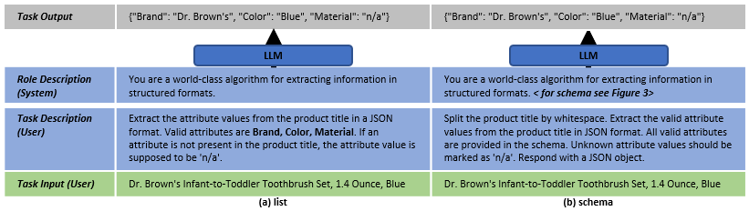

# Attribute Value Extraction using Large Language Models
This repository contains code and data for experiments on attribute value extraction using large language models.
A preprint of the paper "Product Attribute Value Extraction using Large Language Models" can be found [here](https://arxiv.org/abs/2310.12537).

## Requirements

We evaluate hosted LLMs, such as GPT-3.5 and GPT-4, as well as open-source LLMs based on LLAMA2 which can be run locally. 

For the hosted LLMs an OpenAI access tokens needs to be placed in a `.env` file at the root of the repository.
To obtain this OpenAI access token, users must [sign up](https://platform.openai.com/signup) for an OpenAI account.

To run the open-source LLMs GPU-support is required.

## Installation

The codebase requires python 3.9 To install dependencies we suggest to use a conda virtual environment:

```
conda create -n avellms python=3.9
conda activate avellms
pip install -r requirements.txt
pip install pieutils/
```

## Dataset

For this work we use subsets of two datasets from related work: [OA-Mine](https://github.com/xinyangz/OAMine/) and [AE-110k](https://github.com/cubenlp/ACL19_Scaling_Up_Open_Tagging/).
Each subset contains product offers from 10 distinct product categories and is split into small train, large train and test set.
OA-Mine contains 115 attributes and AE-110k contains 101 attributes.
Further statistics and information about the subsets can be found in the table below and in the paper.

|                     | OA-Mine Small Train       | OA-Mine Large Train      | OA-Mine Test       | AE-110K Small Train     | AE-110K Large Train   | AE-110K Test       |
|---------------------|----------------|--------------|--------------|---------------|--------------|--------------|
| Attribute/Value Pairs| 1,467         | 7,360        | 2,451        | 859           | 4,360        | 1,482        |
| Unique Attribute Values | 1,120      | 4,177        | 1,749        | 302           | 978          | 454          |
| Product Offers      | 286            | 1,452        | 491          | 311           | 1,568        | 524          |


The dataset subsets of OA-Mine and AE-110k can be available in the folder `data\processed_datasets`.

If you want to start from scratch, you can download the datasets and preprocess them yourself.
The dataset OA-Mine and AE-110k have to be added as raw data to the folder `data\raw`.
For OA-Mine the annoations can be downloaded [here](https://github.com/xinyangz/OAMine/tree/main/data).
For AE-110k the annoations can be downloaded [here](https://github.com/cubenlp/ACL19_Scaling_Up_Open_Tagging/blob/master/publish_data.txt).
The data is then preprocessed using the script `prepare_datasets.py` in the folder `preprocessing`.
The script can be run using the following command:

```
scripts\00_prepare_datasets.sh
```

## Prompts

We experiment with zero-shot prompts and prompts that use training data.
For both scenarios, the two target schema descriptions (a) list and (b) schema are used.
The following figure shows the prompt structures for the two schema descriptions.


### List 
The list description iterates over the target attribute names for the extraction. The prompt looks as follows:
    
```
System: You are a world-class algorithm for extracting information in structured formats. 
User: Extract the attribute values from the product title in a JSON format. 
      Valid attributes are Brand, Color, Material. 
      If an attribute is not present in the product title, the attribute value is supposed to be 'n/a'.
User: Dr. Brown's Infant-to-Toddler Toothbrush Set, 1.4 Ounce, Blue
```

### Schema
The schema description iterates over the target attribute names, descriptions and example values. The prompt looks as follows:

``` 
System: You are a world-class algorithm for extracting information in structured formats.
		{
			'name': 'Toothbrush',
			'description': 'Correctly extracted `Toothbrush` with all the required parameters with correct types.',
			'parameters': {
				'type': 'object',
				'properties': {
					'Brand': {
						'description': 'The brand of the toothbrush.',
						'examples': ['Philips Sonicare', 'Sewak Al-Falah', 'GUM', 'Oral-B Pro Health', 'Arm & Hammer', 'Colgate', 'JoJo', 'Wild & Stone', 'Glister', 'Oral-b Vitality'],
						'type': 'string'
					},
					'Color': {
						'description': 'The color of the toothbrush.',
						'examples': ['Pink', 'White', 'Spiderman', 'Multi', 'Four Colours', 'Blue and White', 'Sparkle & Shine', 'Lunar Blue', 'Black', 'Soft'],
						'type': 'string'
					},
					'Material': {
						'description': 'The material used in the toothbrush.',
						'examples': ['Miswak', 'Bamboo', 'Sewak', 'Plant-Based Bristles', 'Wood', 'Nylon', 'Tynex Bristle', 'Silicone'],
						'type': 'string'
					}
				}
			}
		}
User: Split the product title by whitespace.
      Extract the valid attribute values from the product title in JSON format.
      Keep the exact surface form of all attribute values. 
      All valid attributes are provided in the JSON schema. 
      Unknown attribute values should be marked as n/a.
User: Dr. Brown's Infant-to-Toddler Toothbrush Set, 1.4 Ounce, Blue
```

### Example Product Offers for testing

We provide a list of example product offers (Task Input) and the expected output (Task Output).
These examples can be used to quickly test the LLMs and the prompts.

``` 
User: Dr. Brown's Infant-to-Toddler Toothbrush Set, 1.4 Ounce, Blue
Expected Task Output (Answer by the LLM): 
{
    "Brand": "Dr. Brown's",
    "Color": "Blue",
    "Material": "n/a"
    "Age": "Infant-to-Toddler"
    "Size": "n/a"
}

``` 

``` 
User: SJP by Sarah Jessica Parker Women's Fawn Pointed Toe Dress Pump, Candy, 6.5 Medium US
Expected Task Output (Response of the LLM): 
{
  "Brand": "SJP by Sarah Jessica Parker",
  "Gender": "Women's",
  "Model name": "Fawn",
  "Shoe type": "Pointed Toe Dress Pump",
  "Color": "Candy",
  "Size": "6.5 Medium US"
  "Sport": "n/a"
}

```

``` 
User: Bigelow Green Tea with Wild Blueberry & Acai, 20 Count Box (Pack of 6), Caffeinated Green Tea, 120 Teabags Total
Expected Task Output (Response of the LLM): 
{
  "Brand": "Bigelow",
  "Tea variety": "Green Tea",
  "Flavor": "Wild Blueberry & Acai",
  "Net content": 120,
  "Pack size": "Pack of 6",
  "Caffeine content": "Caffeinated",
  "Item form": "Teabags"
}

```

``` 
User: YTQHXY Crank Fishing Lure 60mm 6.5g Artificial Hard Bait Wobblers 3D Eyes Plastic Japan Bait Bass Perch Fishing Peche YE-512
Expected Task Output (Response of the LLM): 
{
  "Model Number": "YE-512",
  "Brand Name": "YTQHXY",
  "Length": "60mm",
  "Weight": "6.5g"
}

``` 

``` 
User: POLISI Children Kids Winter Skate Snowmobile Glasses Snowboard Ski Snow Goggles UV400 Anti-Fog Lens Skiing Eyewear
Expected Task Output (Response of the LLM): 
{
  "Sport Type": "Skiing",
  "Brand Name": "POLISI"
  "Lenses Optical Attribute": "UV400 Anti-Fog Lens",
  "Frame Material": "n/a"
}

``` 

### Execution

The prompts and the code to execute the prompts are defined in the folder `prompts`.
You can run the zero-shot prompts and prompts using training with the following scripts:

```
scripts/01_run_zero_shot_prompts.sh
scripts/02_run_prompts_with_training_data.sh
```

## Fine-tuning
The python scripts to prepare the data for the fine-tuning of the LLMs are located in the folder `finetuning`.
The fine-tuning can be run using the following scripts:

```
scripts/03_prepare_fine_tuning.sh
```

You find support for uploading the data to the OpenAI API and to start the finetuning in the folder `pieutils\open_ai_scripts`.
Further information can be found in [OpenAI's guides for fine-tuning](https://platform.openai.com/docs/guides/fine-tuning).
